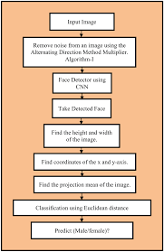

# Gender Detection System – README 

  

## Project Overview:

This project detects the gender of a person in real-time using computer vision and deep learning.
It uses a trained CNN-based model integrated with OpenCV for face detection and classification.

The system can process:
	•	Webcam feed
	•	Images
	•	Video files

  ### Technologies Used:
  
	•	Python
	•	OpenCV
	•	TensorFlow / Keras
	•	NumPy

  ### How It Works:

  
	1.	Face detection using OpenCV
	2.	Preprocessing (resize, normalization)
	3.	Gender prediction using trained CNN model
	4.	Display result with bounding box

### How to run:

1. Run requirement.txt

